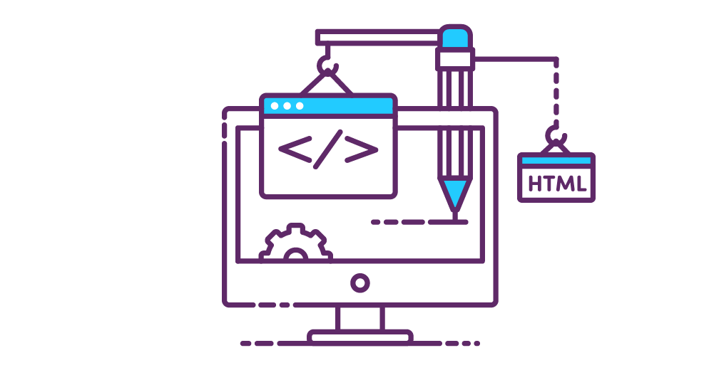
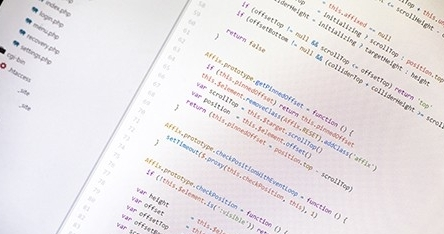
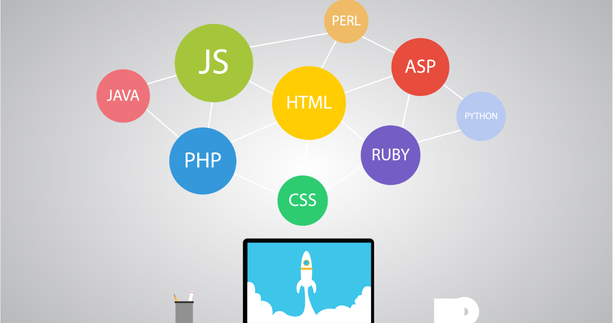
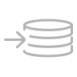

 
<Hero slots="image, icon, heading, text, buttons" variant="halfwidth" />

# Enhance and extend Dreamweaver

Dreamweaver provides its own API as well as the Common Extensibility Platform (CEP), and offers you the flexibility of using C++, HTML, CSS, and JS to build extensions for Dreamweaver. You can extend the Dreamweaver UI, add powerful features for building web apps and automate entire cross-application workflows.

* [Start building today](https://helpx.adobe.com/dreamweaver/apiref/topics.html)

<TextBlock slots="image, heading, text" width="33%" theme="light" isCentered />

### Build custom web development tools

Import database data into web forms, auto-generate web layouts from designs, provide easy construction of web UI components, and more.

<TextBlock slots="image, heading, text" width="33%" theme="light" isCentered />

### Drive web development through automation

Both the Dreamweaver API and CEP give you the power to develop automatic processes and workflows across Adobe Creative Cloud apps.

<TextBlock slots="image, heading, text" width="33%" theme="light" isCentered />

### Build on a familiar foundation

Use CEP and the web development skills you already have to create your own HTML-based panels that provide the specific functionality you want.

<TextBlock slots="image, heading, text" width="33%" theme="light" isCentered />

### Extend Dreamweaver using C++ or JavaScript

Write extensions built in C++ or JavaScript that use the API to add your own functionality to Dreamweaver. Scripts written in JavaScript can work with C++ extensions or stand on their own.

<TextBlock slots="image, heading, text" width="33%" theme="light" isCentered />

### Add server-side functions to your extensions

The Dreamweaver API lets you access server-side data, load server-side scripts, and even support new web server models in your extensions.

<TextBlock slots="image, heading, text" width="33%" theme="light" isCentered />

### Add your own menus, panels, toolbars, reports, and inspectors

Your extensions can modify the Dreamweaver UI in almost any way you want. Add new items to menus and toolbars or entirely new ones; create your own floating panels, reports, and property inspectors.

<SummaryBlock slots="image, heading, text, buttons" background="rgb(9, 90, 186)" />

## Subscribe to the Creative Cloud developer newsletter 

A monthly newsletter featuring news for anyone who creates, develops, or build plugins, extensions, or integrations for the
Creative Cloud family of products.

* [Subscribe to the newsletter](https://www.adobe.com/subscription/ccdevnewsletter.html)